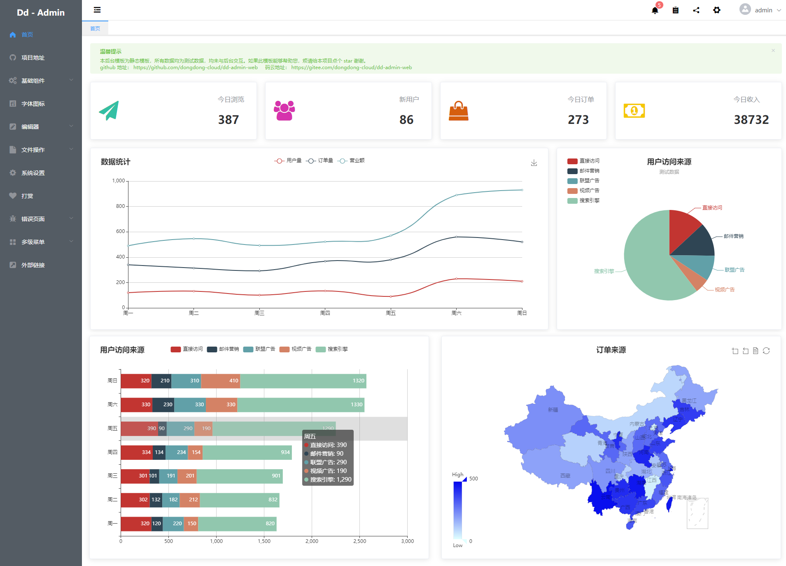
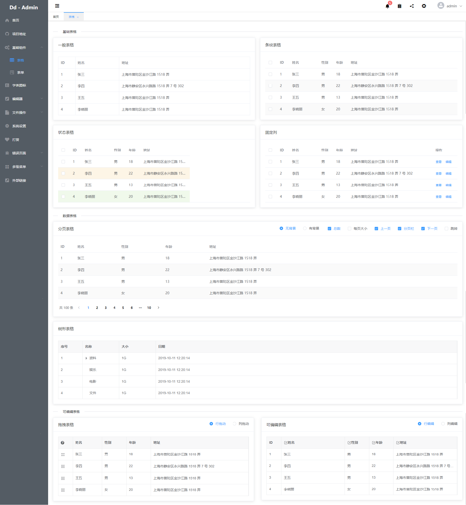
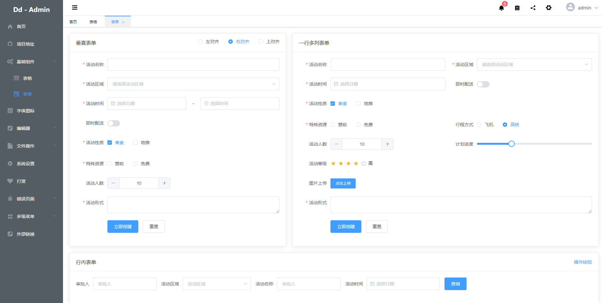
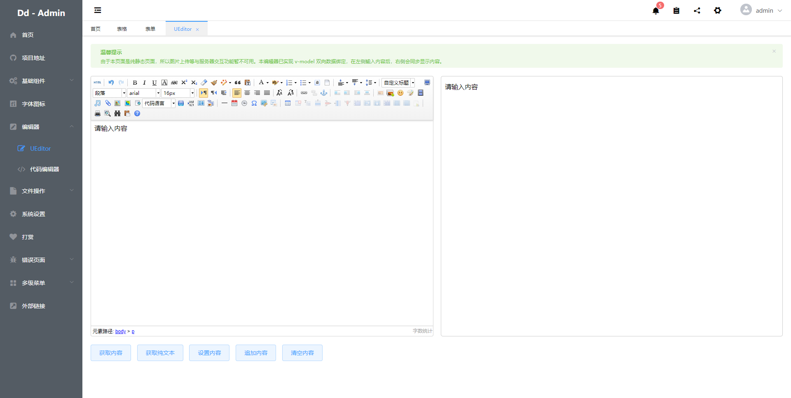
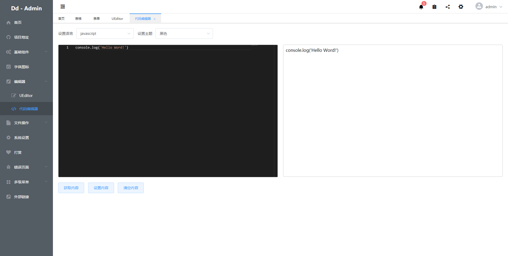

<h2 align="center">Dd - Admin 后台管理模板</h2>
<div align="center">
  <a href="https://github.com/vuejs/vue">
    
  </a>
  <a href="https://github.com/ElemeFE/element">
    
  </a>
  <a href="https://www.echartsjs.com/zh/index.html">
    
  </a>
  <a href="https://github.com/dongdong-cloud/dd-admin-web">
    
  </a>
</div>

dd-admin-web是一个前端解决方案，基于 vue 2 和 element-ui 2.12.0 开发的后台管理模板。功能涵盖动态路由、富文本编辑、图表统计等多种丰富组件。能够快速帮助中小型企业搭建后台产品模型。


### 功能简介

- 登录 / 注销

- 动态路由
  - 登录验证
  - 权限控制（开发中）
- 全局功能
  - 全屏控制（开发中）
  - 菜单收缩展开
  - 多级路由（菜单）嵌套
  - 面包屑设置
  - 个性页签视图
  - 丰富图表实例
  - 多种字体图标
  - 页面自适应
  - 个性化皮肤（开发中）
  - 国际化语言（开发中）
  - 支持外部链接
- 基础组件
  - 表格
    - 基础表格
    - 分页表格
    - 可编辑表格
    - 拖拽表格（支持行拖拽和列拖拽）
  - 表单
    - 垂直表单
    - 行内表单
    - 多列表单
- 字体图标
- 编辑器
  - ueditor
  - 代码编辑器
- 文件操作
  - Excel（开发中）
  - Zip（开发中）
  - PDf（开发中）
- 错误页面
  - 401页面
  - 404页面
  - 500页面
  
### 系统截图







### 安装步骤

``` bash
# 安装依赖
npm install

# 访问地址 localhost:8088
npm run dev

# 编译打包
npm run build
```

### 目录结构

```
├── build                       // help
├── config                      // 配置文件
├── src                         // 核心代码
│   ├── assets                  
│   ├── auth                    // 登录认证相关
│   ├── components              // vue 组件
│   ├── config                  // 配置控制
│   ├── json                    // json 文件
│   ├── router                  // 路由控制
│   ├── store                   // vuex 存储
|   |   ├── modules
|   |   ├── getter.js
|   |   └── index.js
│   ├── utils                   // 工具
│   ├── views                   // 视图
│   |   ├── basic               // 基础组件
│   |   ├── components          // 视图组件
│   |   ├── editor              // 编辑器组件
│   |   ├── menu-1              // 多级菜单
│   |   ├── home.vue            // 项目主框架
│   |   ├── login.vue           // 登录
│   |   └── settings.vue        // 侧边设置
│   ├── App.vue                 // 根路由视图
│   └── main.js                 // 项目入口
├── static
│   ├── ueditor                 // ueditor插件
│   └── .gitkeep
├── test                        
├── .babelrc
├── .editorconfig
├── .eslintignore
├── .eslintrc.js          
├── .gitignore
├── .postcssrc.js
├── README.md                     // read me
├── index.html                    // 项目首页
├── package-lock.json
└── package.json
```

### 浏览器兼容

## Browsers support

| [](http://godban.github.io/browsers-support-badges/)<br>IE / Edge | [](http://godban.github.io/browsers-support-badges/)<br>Firefox | [](http://godban.github.io/browsers-support-badges/)<br>Chrome | [](http://godban.github.io/browsers-support-badges/)<br>Safari | [](http://godban.github.io/browsers-support-badges/)<br>iOS Safari | [](http://godban.github.io/browsers-support-badges/)<br>Opera |
| --------- | --------- | --------- | --------- | --------- | --------- |
| IE11, Edge| last 2 versions| last 2 versions| last 2 versions| last 2 versions| last 2 versions

### 捐赠
---

### 其他
---
本项目部分灵感来源于其他开源项目el-admin
